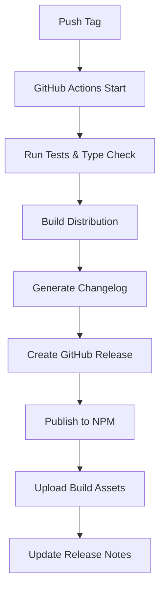

# Release Guide

This document explains how to release a new version of the KTON SDK.

## Release Types and Versioning

KTON SDK follows [Semantic Versioning](https://semver.org/):

- **MAJOR** version (X.0.0): Incompatible API changes
- **MINOR** version (0.X.0): New functionality in a backward-compatible manner
- **PATCH** version (0.0.X): Backward-compatible bug fixes

### Current Version: 1.1.2

#### Recent Major Releases

- **v1.1.2** - Maintenance release with stability improvements
- **v1.1.0** - Added pKTON LST support with dual protocol functionality
- **v1.0.0** - Initial stable release with KTON support

## Automated Release Process

This project uses GitHub Actions for automated releases, including:

- ✅ Automatic GitHub Release creation
- ✅ Automatic NPM publishing  
- ✅ Automatic changelog generation
- ✅ Automatic build artifact uploads
- ✅ Type declaration generation
- ✅ Bundle size reporting

## Publishing New Versions

### Method 1: Using npm scripts (Recommended)

#### Patch Release (Bug fixes: 1.1.2 → 1.1.3)
```bash
npm run release:patch
npm run release:push
```

#### Minor Release (New features: 1.1.2 → 1.2.0)
```bash
npm run release:minor
npm run release:push
```

#### Major Release (Breaking changes: 1.1.2 → 2.0.0)
```bash
npm run release:major
npm run release:push
```

### Method 2: Manual Process

1. **Update version number**:
   ```bash
   npm version patch  # or minor, major
   ```

2. **Update documentation** (if needed):
   - Update version references in README.md
   - Update CHANGELOG.md with new changes
   - Update bundle sizes if significantly changed

3. **Create and push tag**:
   ```bash
   git push origin main --tags
   ```

## Pre-release Versions

For beta testing and preview releases:

### Beta Releases
```bash
npm version 1.2.0-beta.1 --no-git-tag-version
git add package.json
git commit -m "chore: bump version to 1.2.0-beta.1"
git tag v1.2.0-beta.1
git push origin main --tags
```

### Alpha Releases
```bash
npm version 1.2.0-alpha.1 --no-git-tag-version
git add package.json  
git commit -m "chore: bump version to 1.2.0-alpha.1"
git tag v1.2.0-alpha.1
git push origin main --tags
```

Pre-release versions will:
- Be marked as "Pre-release" in GitHub Releases
- Be published to NPM under the `beta`/`alpha` tag instead of `latest`
- Not trigger major announcements

## Release Preparation Checklist

### Before Any Release

- [ ] **Code Quality**
  - [ ] All tests pass (`npm test`)
  - [ ] TypeScript type checks pass (`npm run typecheck`)
  - [ ] ESLint checks pass (`npm run lint`)
  - [ ] Code formatting is consistent (`npm run format`)
  - [ ] Build completes successfully (`npm run build`)

- [ ] **Documentation**
  - [ ] README.md reflects new features/changes
  - [ ] CHANGELOG.md has entry for new version
  - [ ] API documentation is updated
  - [ ] Examples work with new version

- [ ] **Functionality**
  - [ ] Demo application works correctly
  - [ ] Both KTON and pKTON protocols tested
  - [ ] Token switching functionality verified
  - [ ] New features thoroughly tested

### For Major Releases (X.0.0)

- [ ] **Breaking Changes**
  - [ ] Migration guide updated
  - [ ] Deprecation warnings removed
  - [ ] API changes documented
  - [ ] Version compatibility matrix updated

- [ ] **Communication**
  - [ ] Release announcement prepared
  - [ ] Community notifications planned
  - [ ] Documentation site updated

### For Feature Releases (0.X.0)

- [ ] **New Features**
  - [ ] Feature documentation complete
  - [ ] Usage examples provided
  - [ ] Demo updated to showcase features
  - [ ] TypeScript types exported

### For Patch Releases (0.0.X)

- [ ] **Bug Fixes**
  - [ ] Fixes verified with test cases
  - [ ] Regression testing completed
  - [ ] No new features accidentally included

## Release Process Overview

When you push a version tag (like `v1.1.2`) to GitHub, the following automated process triggers:



### Detailed Steps

1. **Test and Build**: 
   - Run comprehensive tests on Node.js 16, 18, 20
   - Execute TypeScript compilation
   - Generate ESM and UMD bundles
   - Create type declaration files

2. **Create Release**: 
   - Auto-generate changelog from git commits
   - Create GitHub Release with generated notes
   - Tag release appropriately

3. **Publish to NPM**: 
   - Verify version number matches git tag
   - Publish package to NPM registry
   - Set correct dist-tags (latest/beta/alpha)

4. **Upload Assets**: 
   - Upload built distribution files
   - Include source maps
   - Attach TypeScript declarations

5. **Post-Release**: 
   - Update release description with NPM links
   - Generate bundle size reports
   - Notify monitoring systems

## Environment Setup

### Required GitHub Secrets

Ensure your GitHub repository has these secrets configured:

- `NPM_TOKEN`: NPM publishing token with publish permissions
- `GITHUB_TOKEN`: Automatically provided by GitHub Actions

### NPM Token Setup

1. Generate token at https://www.npmjs.com/settings/tokens
2. Select "Automation" token type
3. Add to GitHub repository secrets as `NPM_TOKEN`

## Version Management

### Current Supported Versions

| Version | Status | Support End | Notes |
|---------|--------|-------------|--------|
| 1.1.x | ✅ Active | TBD | Current stable with pKTON support (v1.1.2) |
| 1.0.x | ⚠️ Maintenance | 2025-12-31 | Security fixes only |

### Version Rollback

If you need to rollback a release:

1. **Unpublish from NPM** (within 72 hours):
   ```bash
   npm unpublish kton-sdk@1.1.2 --force
   ```

2. **Delete GitHub Release**:
   - Go to repository releases page
   - Delete the problematic release

3. **Delete git tag**:
   ```bash
   git tag -d v1.1.2
   git push origin :refs/tags/v1.1.2
   ```

4. **Communicate the rollback**:
   - Notify users via appropriate channels
   - Document the reason for rollback

## Release Notes Guidelines

### Commit Message Format

Use conventional commits for automatic changelog generation:

```
feat: add pKTON protocol support
fix: resolve testnet API endpoint issue  
docs: update README with new examples
chore: update dependencies
```

### Release Note Categories

- 🚀 **Major Features**: New significant functionality
- ✨ **Added**: New features and capabilities
- 🔧 **Enhanced**: Improvements to existing features
- 🐛 **Fixed**: Bug fixes and corrections
- 📚 **Documentation**: Documentation updates
- ⚠️ **Breaking Changes**: Incompatible changes (major versions only)

## Monitoring and Verification

### Post-Release Checks

1. **NPM Package**: https://www.npmjs.com/package/kton-sdk
   - Verify correct version published
   - Check package contents
   - Confirm download statistics

2. **GitHub Release**: https://github.com/KTON-IO/KTON-SDK/releases
   - Verify release notes accuracy
   - Check attached assets
   - Confirm tag matches version

3. **CDN Distribution**: 
   - Test unpkg.com delivery: `https://unpkg.com/kton-sdk@latest/`
   - Verify bundle integrity
   - Check file sizes match expectations

4. **Documentation**:
   - Ensure version numbers updated
   - Verify examples still work
   - Check API documentation accuracy

### Performance Monitoring

Track these metrics post-release:

- Bundle size changes
- NPM download statistics  
- GitHub star/fork activity
- Issue reports and feedback
- TypeScript compilation performance

## Troubleshooting

### Common Issues

1. **Version mismatch error**:
   - Ensure `package.json` version matches git tag exactly
   - Check for pre-release suffixes

2. **NPM publish failure**:
   - Verify `NPM_TOKEN` is valid and has publish permissions
   - Check if version already exists
   - Ensure package name is available

3. **Test failures during release**:
   - Run `npm test` locally first
   - Check for environment-specific issues
   - Verify all dependencies are correctly installed

4. **Build failures**:
   - Run `npm run build` locally
   - Check for TypeScript errors
   - Verify all imports resolve correctly

5. **GitHub Actions timeout**:
   - Check for long-running tests
   - Monitor resource usage
   - Consider splitting complex workflows

### Emergency Procedures

#### Critical Bug in Released Version

1. **Immediate Response**:
   ```bash
   # Quick patch release
   npm version patch
   # Fix the critical bug
   git add .
   git commit -m "fix: critical bug in [feature]"
   npm run release:push
   ```

2. **Communication**:
   - Post issue acknowledgment
   - Provide workaround if possible
   - Announce fix timeline

#### Compromised Release

1. **Immediate Actions**:
   - Unpublish affected version from NPM
   - Delete GitHub release
   - Revoke and regenerate NPM tokens

2. **Investigation**:
   - Audit commit history
   - Check for unauthorized changes
   - Review access logs

### Support Resources

- **GitHub Actions**: https://github.com/KTON-IO/KTON-SDK/actions
- **NPM Package**: https://www.npmjs.com/package/kton-sdk
- **GitHub Releases**: https://github.com/KTON-IO/KTON-SDK/releases
- **Issues**: https://github.com/KTON-IO/KTON-SDK/issues
- **Discussions**: https://github.com/KTON-IO/KTON-SDK/discussions

---

For questions about the release process, please open an issue or discussion in the repository.